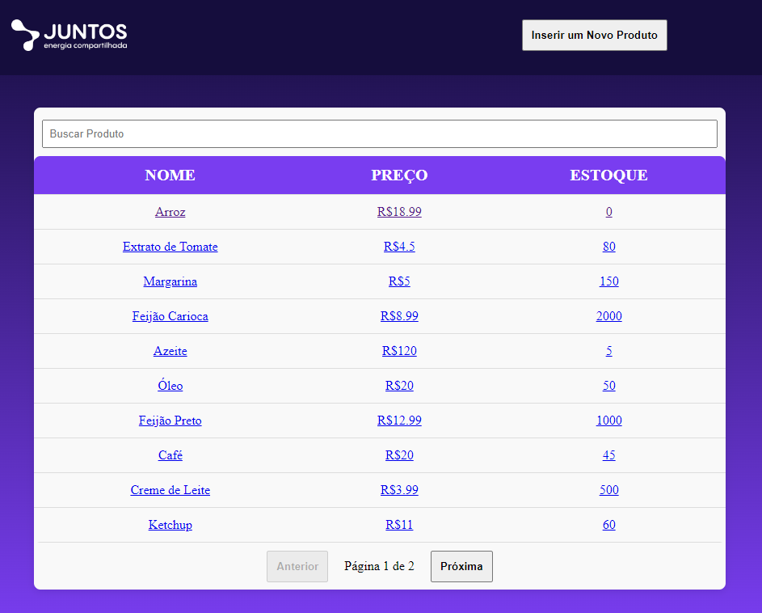

# Sistema de Gerenciamento de Produtos

Um sistema para gerenciar produtos, permitindo a visualização, adição, atualização e exclusão de produtos. O sistema inclui funcionalidades de busca e paginação.




## Desafios Pessoais no Desenvolvimento

O sistema foi desenvolvido para o Processo Seletivo da Juntos Energia, agradeço desde já a oportunidade.


Sem dúvidas minha maior dificuldade foi utilizar novas tecnologias como Vue, pois nunca tinha utilizado esse framework anteriormente, o que rendeu algumas horas na documentação e muito aprendizado, e o PouchDB, que apesar de simples, complica algumas rotas, principalmente a de PUT por conta do atributo _rev.

O tempo foi um quesito razoavelmente limitante visto a pequena pressão, mas acredito que cumpri com os requisitos do sistema e espero que gostem do resultado!

## Funcionalidades

- **Visualização de Produtos**: Listagem de todos os produtos com detalhes como nome, preço e estoque.
- **Adição de Produto**: Adicionar novos produtos através do botão "Inserir um Novo Produto" que abrirá um modal com os dados do produto adicionado.
- **Atualização de Produto**: Atualizar informações de produtos existentes clicando no produto desejado, o qual irá redirecionar para uma página do produto.
- **Exclusão de Produto**: Na mesma página do produto, é possível deletar o produto através de um botão "Deletar Produto".
- **Busca por Nome**: Filtrar produtos pelo nome na barra de pesquisa sobre a tabela de produtos.
- **Paginação**: Navegar entre as páginas de produtos com os botões no inferior da tabela.
- **Ordenação (Em Desenvolvimento)**: Ordenar produtos por nome, preço ou estoque ao clicar nos cabeçalhos da tabela.

## Pré-requisitos

Antes de rodar o projeto, certifique-se de ter instalado:

- [Node.js](https://nodejs.org/) (versão 14 ou superior)
- [npm](https://www.npmjs.com/)

## Como Rodar o Projeto

### 1. Backend

1. Instale as dependências do projeto:
    ```bash
    npm install
    ```

2. Navegue para o diretório do backend:
    ```bash
    cd backend
    ```

3. Instale as dependências do backend:
    ```bash
    npm install
    ```

4. Inicie o servidor backend:
    ```bash
    npm run dev
    ```

O servidor backend será iniciado na porta padrão (`http://localhost:3000`).

### 2. Frontend

1. Navegue para o diretório do frontend:
    ```bash
    cd frontend
    ```

2. Instale as dependências do frontend:
    ```bash
    npm install
    ```

3. Inicie o servidor frontend:
    ```bash
    npm run serve
    ```

O servidor frontend será iniciado na porta padrão (`http://localhost:8080`).

## API Endpoints

### Produtos

- `GET /products`: Retorna uma lista paginada de produtos.
- `GET /products/:id`: Retorna apenas o produto buscado.
- `POST /products`: Adiciona um novo produto.
- `PUT /products/:id`: Atualiza um produto existente.
- `DELETE /products/:id`: Deleta um produto existente.

## Tecnologias Utilizadas

- **Backend**: Node.js, Express, PouchDB
- **Frontend**: Vue.js
- **Gerenciamento de Pacotes**: npm

## Autores e Contribuidores

- [Isaac Almeida](https://github.com/isaac-prado)